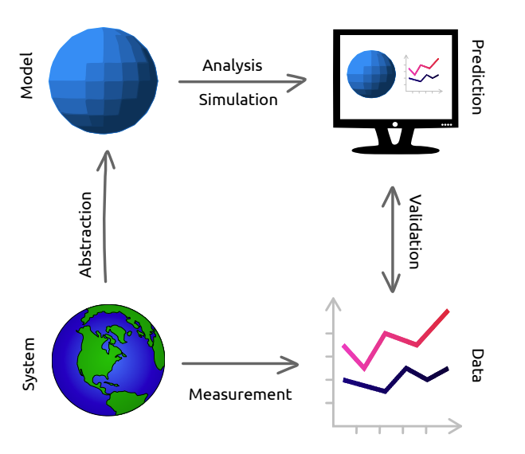

# ModSimPy Notes
Notes on [Modeling and Simulation in Python](https://github.com/AllenDowney/ModSimPy). A copy of the book is included in this repository as [ModSimPy3.pdf](./ModSimPy3.pdf), and was downloaded from [Green Tea Press](https://greenteapress.com/wp/modsimpy/).

* [Pre-Requisites](#pre-requisites)
* [Getting Started](#getting-started)
* [Chapter 1: Modeling](#chapter-1-modeling)

## Pre-Requisites
1. Install `git` (if not already installed)
2. Install [Miniconda](https://docs.conda.io/en/latest/miniconda.html) (for `conda` command)

## Getting Started
1. Clone the repository (using commit [c36a47](https://github.com/AllenDowney/ModSimPy/commit/c36a476a20042acb33773e47d12aea5b0c413e60))

       git clone https://github.com/AllenDowney/ModSimPy

2. Create conda environment

       conda env create -f environment.yml

3. Activate newly created conda environment

       conda activate ModSimPy

## Chapter 1: Modeling

Starting from the lower-left corner of the above diagram, and navigating clock-wise:

* **System** - something in the real world we're interested in studying.
* **Abstraction** - often the *system* is complicated, so we have to remove details.
* **Model** - the result of *abstraction*. A description of the system with only the essential details.
* **Analysis** & **Simulation** - model can be represented in diagrams and equations, and implemented in a computer program.
* **Prediction**, **Explanation**, or **Design** - the result of *analysis* and *simulation* might be a **prediction** about what the
system will do, an **explanation** of why it behaves the way it does, or a **design**
intended to achieve a purpose.
* **Validate** - validate predictions and test designs by taking measurements from
the real world and comparing the data we get with the results from analysis
and simulation.

* *Often* **simpler models are best**
* **Iterative Modeling**
  1. Start with a simple model, even if it is likely to be too simple.
  2. Test whether it is good enough for its purpose.
  3. If not good enough for it's purpose, then add features
gradually, starting with the ones you expect to be most essential.

* **Internal Validation** - Comparing results of successive models can catch conceptual, mathematical, and software errors. By adding and removing features, you can tell which ones have the biggest effect on the results, and which can be ignored.
* **External Validation** - Comparing results to data from the real world is generally the strongest test.
